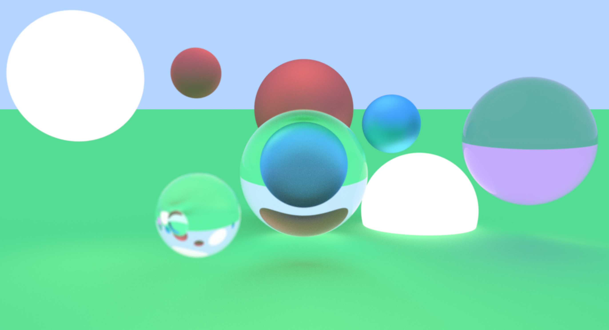
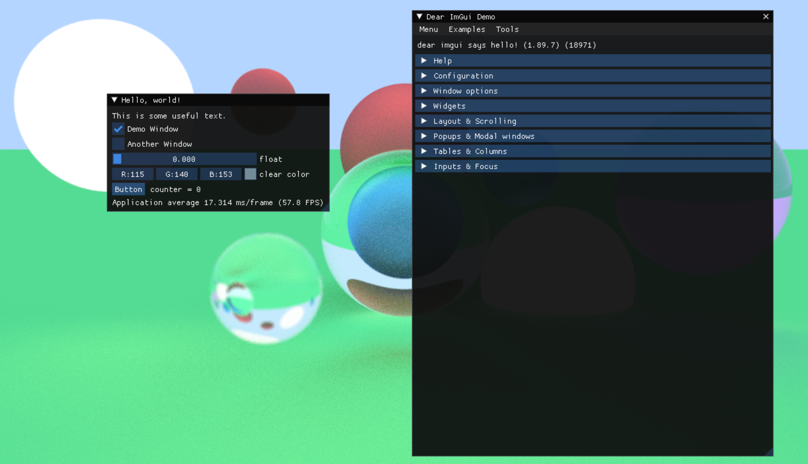

# Simple Raytracer

Slowly implementing a software-based raytracer, which will hopefully be than mildly interactive at some point.



## Current features

-   Spheres, planes, reflective, emissive, dielectric values
-   Can sort of fly the camera around, depth-of-field
-   Features a simple bounding volume hierarchy for an acceleration structure
-   WIP: Slowly adding a UI for live material editing

## Updates/Notes

2023/29/7

Dear IMGUI integration

-   

2023/04/7

-   Some camera control

-   Fonts so I can output metrics to screen?

2023/03/7

-   Finished up BVH

-   Abstracted out user inputs

2023/30/6

-   Bounding Volume Hierachy Construction
    -   <https://jacco.ompf2.com/2022/04/13/how-to-build-a-bvh-part-1-basics/>

The main loop behind BVH construction is actually the QuickSelect algorithm

-   <https://spin0r.wordpress.com/2021/01/01/how-exactly-to-do-linear-time-quickselect-with-duplicate-elements/>
-   <https://en.wikipedia.org/wiki/Quickselect>

Two examples of the main QuickSelect loop are below with the logic as following

-   We have an array of elements which we're first looping through from the front. We continue incrementing the front element until we find an element that is \>= the SplitPos/pivot element. We then swap with the back element, so i is now that element and j is pointing to the previous element. We resume the loop for i (previously the back element) and continue iterating. Eventually the pointers will be adjacent. We either increment i to j or we decrement j to i. We then do a final check of the doubly pointed element. If i is \< than the pivot we increment i and the loop breaks. Then `i` points at the first element of the array containing pivots and up. On the other hand i points to something greater than the pivot. We swap (noop) and decrement j. `i` still points at the front of the array with pivots and up.

-   In the second, we again loop until the front idx points at the first element that is \> pivot, we then loop until j points at the first element \<= pivot. We swap so j slot now has the old i element and vice versa. We decrement both so they point at new elements.

    -   i eventually points to pivot or greater, and j points to a pivot or less

    -   The pointers [i,j] are adjacent and we swap and increment i. Then `i` points to a pivot or greater (i points to a pivot or greater, j points to same place.

    -   

``` cpp
  while (i <= j)
  {
      if (array[i] < SplitPos)
      {
          i++;
      }
      else
      {
          SwapSpheres(array[i], array[j--]);
      }
  }
// 
 
 while (frontIdx < backIdx)
    {
        while (arr[frontIdx] < pivot) {
            ++frontIdx;  //if we exit, then frontIdx points at >= pivot
        }
        while (arr[backIdx] > pivot) {
            --backIdx; //exit, points at <= pivot
        }
        if (frontIdx < backIdx)
        {
            swap(arr + frontIdx++, arr + backIdx);
            //left half will be pivot or less, right pivot or greater
        }
    }
```

2023/29/6

-   Note on random stuff from 28/6 that doesn't work

So made a mistake, random_series \*Series is a POINTER and it was to a global object, which thinking about it now, is also a problem because we had multiple threads working on the same data.... I actually don't know what I was thinking at all yesterday.

The original problem to solve was that having world World meant that each Raycast call modified the internal state but then the internal state was lost between calls.

My original solution was to store a pointer to a state instead.

Now I'm treating World copies as essentially work orders which is probably not good, since it doesn't really make intuitive sense (why is the World different between tiles?) I should probably put it inside the work_order but that's annoying because I would need to allow the render tile function to access the work_order or take a random state.

``` cpp
typedef struct {
    random_series *State; 
} world;

void RenderTile(work_queue *Queue)
{
  work_order Order = Queue.Order[Idx];
  RenderTile(Order=>World)
}

void RenderTile(world World, image_u32 Image, ...)
{
  // Still a pointer
  Raycast(world World, ....)
}
```

-   Start separating out platform layer and raycasting layer
-   How should the RenderTile stuff be abstacted out?

My current RenderTile call takes a Queue and runs work orders off the Queue automatically. The Platform layer can implement this in multi-threaded way. This means that the Raycaster is deciding how to split up the work jobs. Or maybe the platform code should determine stuff like TileWidth and TileHeight? I think this makes sense. From a game perspective the user it passing down settings into the game which then runs. The platform knows how many cores it has etc. So we should have work_queue parameters that get initialized by the platform

``` cpp
CreateWorkOrders(work_queue Queue, image_u32 Image, u32 TileWidth, u32 TileHeight)

void RenderTile(work_queue *Queue)
{
    while(Queue->TilesRetired < Queue->WorkOrderCount)
    {
        u32 WorkOrderIndex = AddAndReturnPreviousValue(&Queue->NextWorkOrder, 1);
        if(WorkOrderIndex >= Queue->WorkOrderCount) return;
        
        work_order *Order = Queue->Orders + WorkOrderIndex;

        RenderTile(Order->World,
                    Order->Image,
                    Order->TileMinX,
                    Order->TileMinY,
                    Order->TileOnePastMaxX,
                    Order->TileOnePastMaxY);

        AddAndReturnPreviousValue(&Queue->TilesRetired, 1);
    }
}
```

2023/28/6

-   Need to seed a random number for each work_order? right now going through World.State pointer

Okay so here's the current issue, right now my random_state \*State is baked into my world struct and my RenderTile call goes RenderTile(World, Image) ....

(NOTE: This doesn't work) Actually maybe less of a problem than I thought, since I pack more work orders with a copy of the `world World` struct, so once the world is packed, then I just update the struct with a new seed

``` cpp
typedef struct {
    u32 MaterialCount;
    material *Materials;
    //other stuff
    random_series *State; //NOTE OOPS
} world;

void RenderTile(world World, image_u32 Image, ...)
  
//work order packing pseudo code
for(u32 TileY = 0; TileY < TileCountY; ++TileY)
  for(u32 TileX = 0; TileX < TileCountX; ++TileX)
    work_order *Order = Queue.Orders + Queue.WorkOrderCount++;
    // ...
    Order->World = World; // we get a copy to the world
    Order->Image = Image;
    // ...
    
    //something like
    Order->World.State =  rand();
```

-   bug fixed ARGB back (shifted way too much), add specularity
-   rays per pixel, implement floating point safe accumulation
-   Everything is too slow, should just multithread

## Multi-threading notes

<https://learn.microsoft.com/en-us/windows/win32/api/processthreadsapi/nf-processthreadsapi-createthread>

``` cpp
HANDLE CreateThread(
  lpThreadAttributes, // NULL
  dwStackSize,    // 0
  lpStartAddress, // ptr to function to be executed by thread
  lpParameter, // a pointer to the variable to be passed to the thread
  dwCreationFlags, // 0 immediately run
  lpThreadId // NULL;
);

DWORD WINAPI ThreadProc( // pass a pointer to this function
  LPVOID lpParameter //thread receives pointer to the data
);
```

-   So I want to convert RenderTile into a thread routine
-   I want the thread routine to continuously compute tiles until there's nothing left
-   So it should take a work queue with the list of tiles to compute

2023/25/6

-   added bounces + random

Made a horrible mistake, I set the seed in the World struct like below and called the functions like

``` cpp
struct {
  u32 state;
} random_series;

struct {
  random_series State;
} world;

for(u32 Row = 0; ...)
  for(u32 Col = 0; ...)
    Raycast(World, Image, ...)
  
void Raycast(world World, image_u32 Image, ...) {
    RandomBilateral(&World.State);
}
```

So every bounce of the Raycast got a new state, but every new call to Raycast got the original world state which was borking the whole thing.

So two options

-   I can have the World be passed by reference or
-   update the world struct to contain a pointer to the random series which will live "globally"

Probably the second since it already contains pointers to the spheres and planes

``` cpp
world World = {};

void Raycast(world *World, ...)
  
// or

struct {
  random_series *State;
} world;

random_series State = {};
State.state = rand();
World.State = &State
// (I should probably come up with better terminology…)
```

2023/24/6

-   Trying to separate out the SDL2 layer from everything else, ray, SDL_ray, math

-   Init SDL2, might want to change UpdateTexture to [SDL_LockTexture()](https://wiki.libsdl.org/SDL2/SDL_LockTexture) apparently
